この記事は [Pokémon Past Generation Advent Calendar 2023](https://scrapbox.io/PokemonPRNGDiscord/Pok%C3%A9mon_Past_Generation_Advent_Calendar_2023) の114日目の記事です．

みなさんこんにちは．

先日RTA向けに制作していた個体値特定ツールが完成したので，何かネタにできないだろうかと書かせていただきました．

今回はふしぎなアメを使用せずに野生ポケモンを倒して経験値を獲得しながら個体値を特定していきます．

きっかけは個体値特定ツールを制作しているときに，TwitterやDiscordなどでちょくちょくアメを50個や100個用意しないと個体値特定できないというのを見かけたことです．
  
ふしぎなアメをそろえた方が個体値を楽に特定することはできますが世代によってはアメの数を揃えるのが大変です．

実際にはステータスを入力するときの基礎ポイントさえ把握できていれば個体値特定することができ，RTAでは事前に戦うポケモンが決まっていることから基礎ポイント表に各レベル毎の獲得基礎ポイントをまとめて，レベルアップ時に表示されるステータスを確認するだけで個体値を特定していきます．
  
アメを使わなくても個体値特定できるよ～という印象を少しでも持っていただければ幸いです．

本ツールは操作することが多くてややこしいですが，正常に操作していればツールを閉じてしまっても閉じる前までの個体値特定状況を復元できる，Gen3以降だけでなくGen1，Gen2にも対応している，自動認識でステータスを入力できるなどといったメリットもありますので興味を持った方はRTAをやってなくても実際に触ってみてもらえたらと思います．
  
元々RTA用に制作し，RTAで使われているスプレッドシートと連携が取れるようにした関係でちょくちょくちぐはぐなツールの操作が入りますが許してください．

個体値特定するまでの一連の作業の録画は[こちら](https://youtu.be/9ijhamiuS6U)．

### ツールの導入など

個体値特定ツールを[こちら](/tools/blink-observer-tool)よりダウンロードします．
  
ツールの基本的な操作は[マニュアル](/tools/blink-observer-tool)や[説明書](/tools/blink-observer-tool)を参考にしてください．

初回起動の場合はDBの取得を忘れないようにお願いします．

### 基礎ポイント表の作成

スプレッドシートで下図のような表を作ります．
  
Pokemonの列に個体値特定したいポケモンの名前(DBを参照する際に使うので誤字に注意)を入力します．

今回はRTAと違ってどのポケモンと戦うのか事前にわからないので，基礎ポイント表は1行だけ0(もしくは事前に入っている分だけ)で埋めておきます(動画ではどのポケモンの個体値を特定するかも決まっていなかったので捕まえた段階でポケモン名と開始レベルを入力しています)．
  
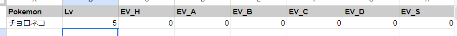
  
※レベルは個体値特定を開始するときのレベルなので，動画のように捕まえたときのステータスを確認せずレベルアップ時でしか見ない場合は，捕まえたときのLv+1にしておきます．

作成したスプレッドシートについて，個体値特定ツールからアクセスできるように，「<p.o.ke.nae.tooldev@gmail.com>」が閲覧できる状態にしておいてください．

マニュアルにあるようにスプレッドシートのリンクをツールにコピペし読み込んで，スプレッドシートのシートと個体値特定したい作品に対応したデータベースを選択します．
  
出力するファイル名には自分がわかるような名前を入力して作成ボタンを押します．

次に基礎ポイント調整の準備を行います．
  
倒す可能性のあるポケモンを攻略本や攻略サイトを参考に調べます．
  
私はOVERLAPのポケットモンスターブラック2・ホワイト2公式ガイドブック完全ストーリー攻略ガイドを使用して3ばんどうろに出現するポケモンを調べました．

ファイル読込ボタンを押してさらにDB読込ボタンを押して，下のプルダウンリストからポケモンを選択して追加するという作業を，倒す可能性のあるポケモンの分だけ行います．
  
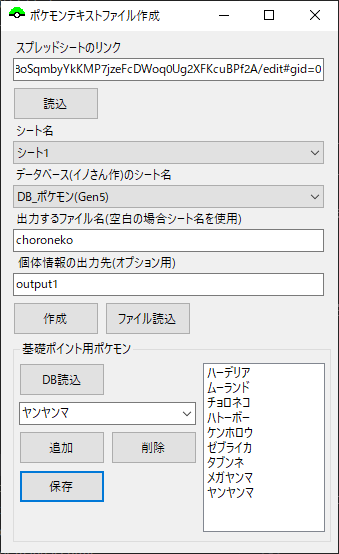
  
完了したら保存ボタンを押し保存します．

### 個体値特定の準備

メニューより個体値特定した作品に対応した個体値特定ツールを選択し起動します．

左上のプルダウンリストから先ほど作成したポケモンのファイルを選択し，左にあるチェックボックスからチェックを外してリセットボタンを押します．

オプションタブよりツールの設定を行います．
  
下図のように設定しておくのが無難かと思います．
  
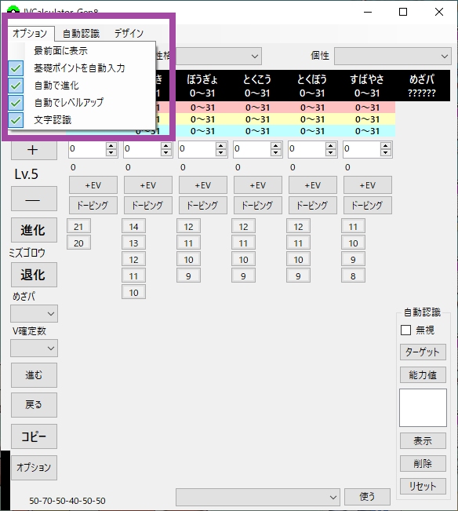

ツール左下のオプションボタンを押してオプションフォームを開きます．
  
下図のように先ほど登録したポケモン名の書かれたボタンが並んでいたら大丈夫です．
  
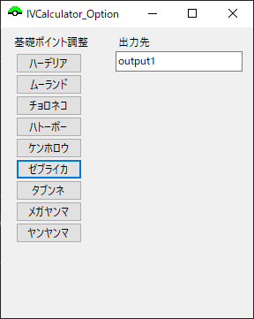

次に自動認識の準備です．
  
手動でステータスを入力する人は飛ばしてもらって大丈夫です．

動画のようにレベルアップするポケモンが個体値特定したいポケモン以外にいないなら右下の無視にチェックを入れます．
  
能力値と書かれたボタンを押し能力値用の自動認識ツールを起動します．
  
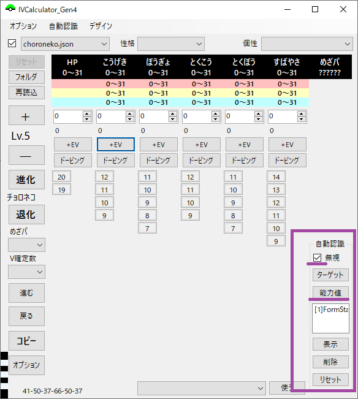

[こちら](/tools/blink-observer-tool)より自分の環境に合った個体値特定したい作品の自動認識のテンプレートを選択し，設定用スプレッドシートのリンクをコピーしツールにペーストします．
  
下のプルダウンリストよりダウンロードした設定を読み込みます．
  
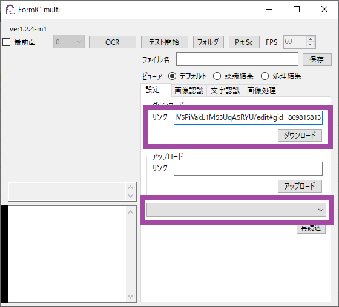

ツール起動時に一緒に出てくる下図のようなフォームの読込ボタンを押し，OBS Virtual Cameraを選択しOKします．
  
Connecting...と表示される場合は映像を読み込むまで，OBS Virtual Cameraの選択を繰り返します．
  
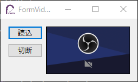

能力値自動認識ツールのテスト開始ボタンを押して，動作することを念のために確認してみてください．
  
確認出来たらテストを停止します．

個体値特定ツールの自動認識タブより自動認識を有効化にチェックを入れて，ツールの左下のシェルユニットが白色(能力値)または水色(ターゲット)に光ればokです．
  
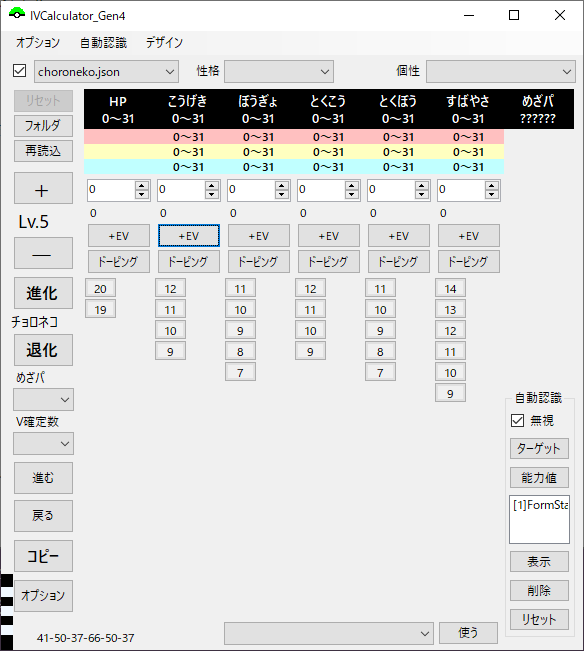

### 個体値特定

野生のポケモンとエンカウントし倒して経験値を稼ぎます．
  
動画では道具を何も使わなかったので育てたいポケモンを先頭において強いポケモンに交代して倒していますが，がくしゅうそうちやしあわせたまごがある場合はそちらを持たせて交代の手間をなくしたり獲得経験値を増やしたりしても構いません．

ただし，獲得基礎ポイントが増えるような道具を持たせる場合はそれらを加味したうえで基礎ポイント加算の操作をしてください．
  
ポケルスにかかっている場合，獲得基礎ポイントが2倍になるので，一度野生ポケモンを倒すごとに野生ポケモン分の加算を2度行う必要があります．

個体値特定を始めていきます．
  
動画では確認していませんが，つよさをみるからステータスや性格，個性などを確認した場合は個体値特定ツールに入力しましょう．

実際に野生ポケモンとエンカウントします．
  
今回はタブンネとエンカウントしたのでオプションフォームでタブンネボタンを押します．
  
すると個体値特定ツールのHPの基礎ポイントが2加算されます．
  
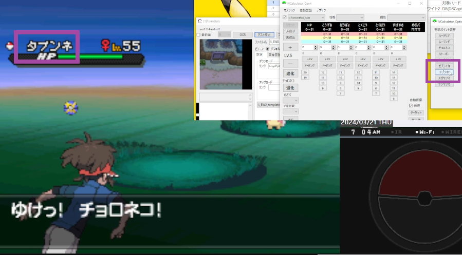
  
もしも何らかのアクシデントで個体値特定したいポケモンに経験値を入れられなかった場合は，個体値特定ツールの戻るボタンを押す or 個体値特定ツールをアクティブにしてCtrl+Zすることで加算した基礎ポイントを無かったことにできます．

控えのポケモンに交代してエンカウントしたポケモンを倒します．
  
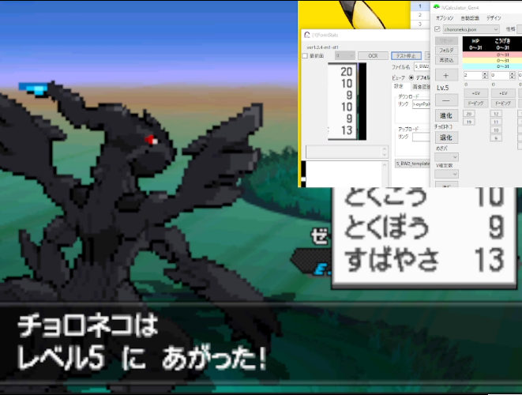
  
レベルアップしたらステータスが表示されるので個体値特定ツールに入力します．
  
自動認識を使っている場合は文字認識に失敗しない限りは自動で入力されます．
  
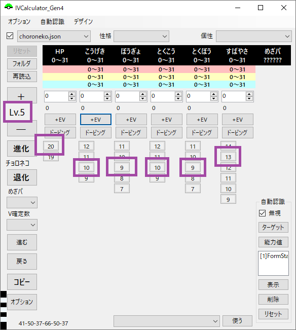

ステータスの入力を間違えた場合は戻るボタンを押す or Ctrl+Zして戻すことができます(戻しすぎたら進むボタン or Ctrl+Y)．
  
レベルダウンボタンを押しても，個体値特定状況は変わらないので戻るボタンで戻るよう気を付けてください．

候補に値がない場合はデータベースの選択や基礎ポイント表が間違ってる可能性があるので確認しましょう．

レベルアップが終わるまでステータスの入力を続けましょう．
  
ここで今回の基礎ポイント表の作成ではチョロネコの情報は入力しましたが，レパルダスの情報は入力していないのでその場合は進化キャンセルをしておきましょう．
  
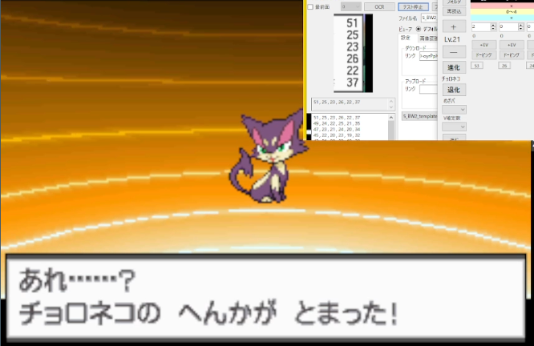

個体値の特定が完了するまでポケモンを倒してレベルを上げていきましょう．
  
動画では2戦目のゼブライカ分の加算を忘れており3戦目に入力していますが，基礎ポイントが4未満でステータス計算に影響がないから何とかなりました．

5戦目あたりで(データベースのフォーマットが異なるのかデータを取得できなかった)ミルホッグとエンカウントした挙句くろいまなざしを決められて倒さざるを得なくなりました．
  
このときはポケ徹でBW2のミルホッグを倒したときに得られる基礎ポイントを調べ，ツールの+EVボタンから入力しました．

### おわり

めざパのタイプが一致していることを確認できました．
  
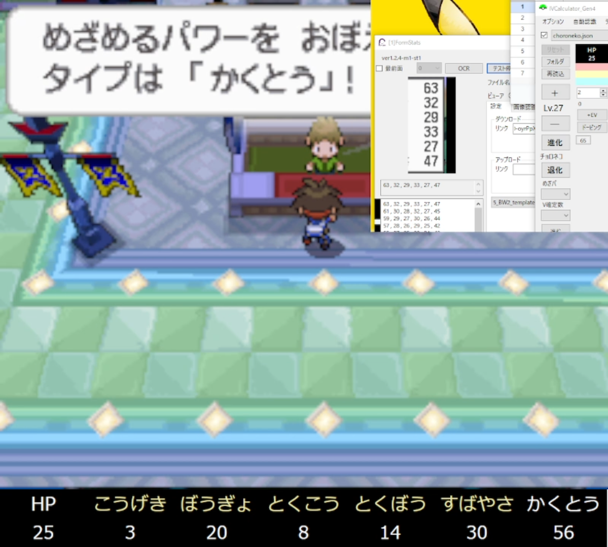

よく使われているポケ徹の個体値カリキュレーターと一致していることも確認できました．
  
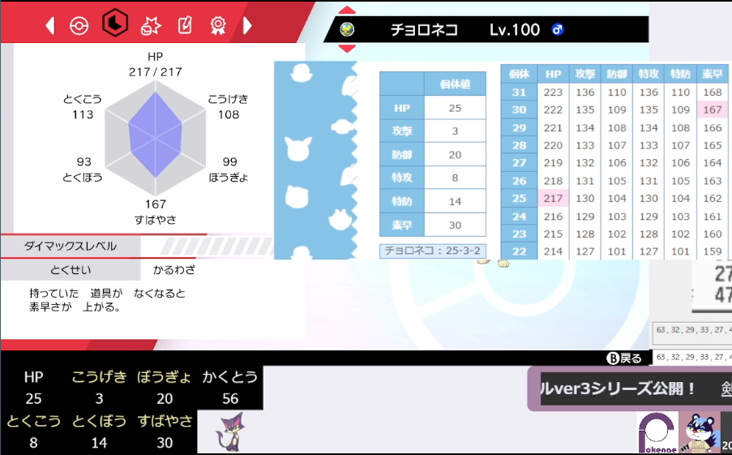

みなさんの個体値特定に対するハードルが少しでも下がれば幸いです．
